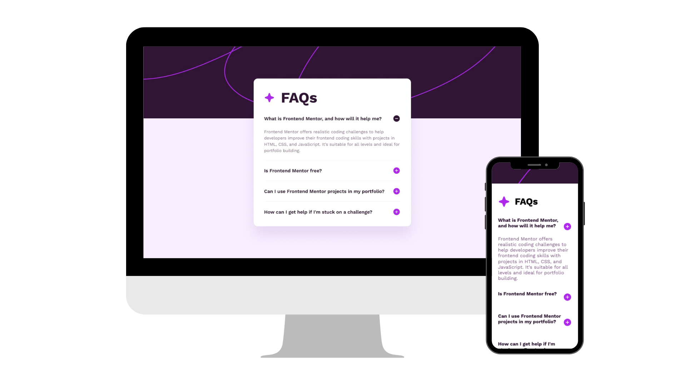

# FAQ Accordion

A FrontendMentor project showcasing frequently asked questions using HTML5, CSS3, SASS and JavaScript . This project provides a clean and responsive layout for users seeking information.

## Preview

## Features

- Responsive design for various screen sizes.
- Clearly organized FAQ sections.
- Implementation using HTML5, CSS3, SASS and Javascript.

## Technologies Used 🛠️

-  HTML5: Used for structuring the web page.
-  CSS3: Responsible for styling and presentation.
-  Sass: CSS extension language with additional features.
-  JavaScript: Used for dynamic behavior.

## Usage Instructions

1. Clone this repository.
2. Navigate to the project directory.
3. Open `index.html` in your web browser to view the FAQ page.
4. Explore the responsive design by resizing your browser window or viewing it on different devices.

## Customization

Feel free to customize and enhance the FAQ page project according to your preferences:

- Edit the FAQ content to suit your specific needs.
- Experiment with different color schemes, typography, and layouts.
- Add or remove questions and answers to better fit the context.

## Contributions

Contributions are welcome! If you have ideas for improvements or want to contribute in any way, please submit a pull request.

## Author ✒️

- **Carmenyo** - [carmenyo](https://github.com/carmenyo)
